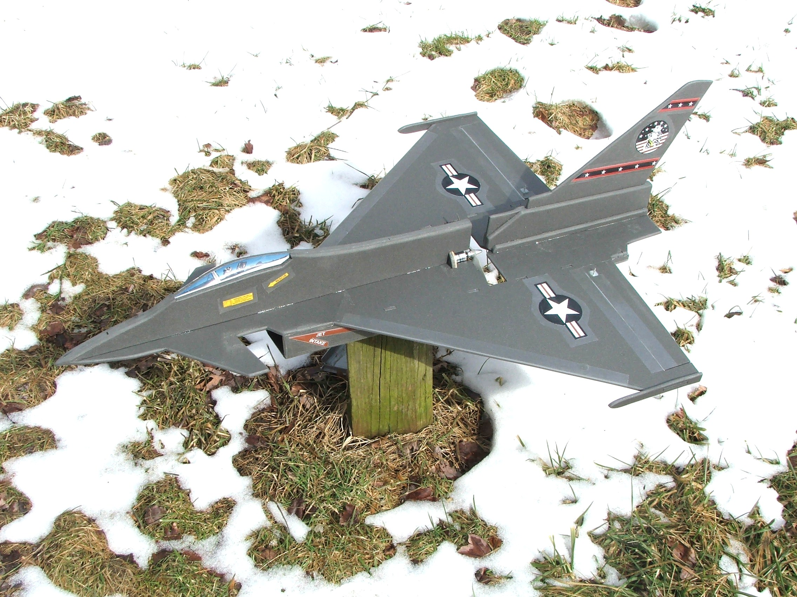

# Description

The Eurofighter Typhoon is a mid-mounted pusher model. It is intended to be flown with tailerons only, but I've also made markings for a rudder. Build it from the plans attached below.

You will have to mark out and cut the slot for the motor.

The dimensions of the slots and tabs are made for 6 mm depron.

# Data

<dl>
  <dt>Wing span</dt>
  <dd>73 cm (29 inches)</dd>
  <dt>Length</dt>
  <dd>101 cm (40 inches)</dd>
  <dt>CoG location</dt>
  <dd><a href="./cg.jpg">12 cm (4.75 inches) from wingbreak</a></dd>
  <dt>Propeller slot</dt>
  <dd>Fits propellers with a maximum diameter of 6 inches</dd>
</dl>

# Build Instructions

Use the [6mmFlyRC MiG-29 instruction manual](../docs/quick-build-mig-29.pdf). The build steps are the same.

# Forum Discussion

http://www.rcgroups.com/forums/showthread.php?t=976693
