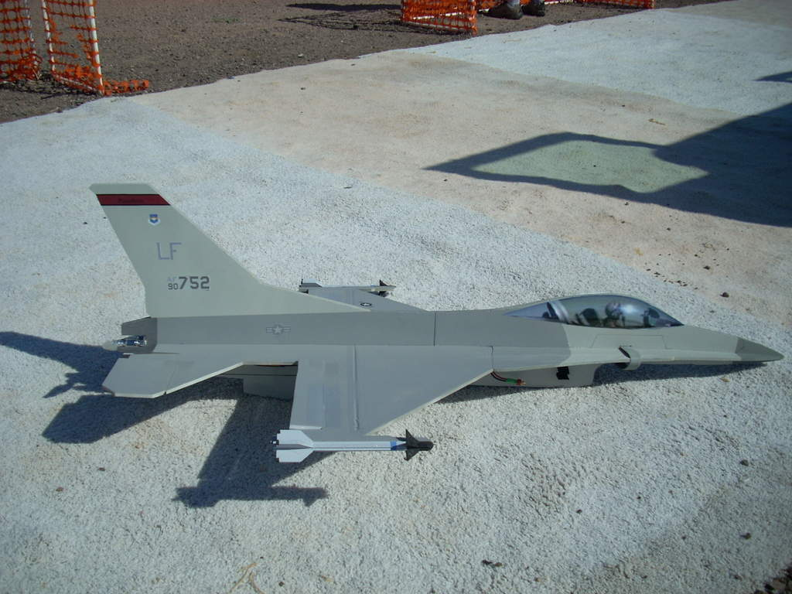

# Description

The F-16 is a tail-mounted pusher model. It can be flown with tailerons only, but I've also made markings for ailerons. Build it from the plans attached below.

It consists of very few parts and will build together in no time.

The dimensions of the slots and tabs are made for 6 mm depron.

# Data

<dl>
  <dt>Wing span</dt>
  <dd>72 cm (28 inches) without wingtips</dd>
  <dt>Length</dt>
  <dd>118 cm (47 inches)</dd>
  <dt>CoG location</dt>
  <dd><a href="./cg.jpg">7.0 cm (2.75 inches) behind wing break</a></dd>
</dl>

# Build instructions

Not available, but much of the steps in the [6mmFlyRC MiG-29 instruction manual](../docs/quick-build-mig-29.pdf) should be very similar.

# Forum discussion

[http://www.rcgroups.com/forums/showthread.php?t=867416](http://www.rcgroups.com/forums/showthread.php?t=867416)

# CAD images



# Build images



# Model images



# Artwork



# Plans



# License


