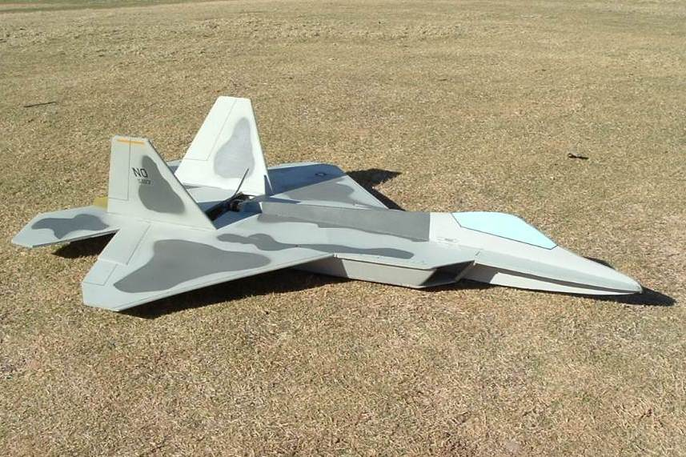

# Description

The F-22 is a mid-mounted pusher model intended to be flown with tailerons only, but it can easily be equipped with ailerons and rudders. Build it from the plans attached below.

The dimensions of the slots and tabs are made for 6 mm depron.

# Data

<dl>
  <dt>Wing span</dt>
  <dd>72.1 cm (28.4 inches)</dd>
  <dt>Length</dt>
  <dd>99.9 cm (39.3 in)</dd>
  <dt>CoG location</dt>
  <dd>8.25 cm (3.25 inches) back from the front of the main wing</dd>
  <dt>Propeller slot</dt>
  <dd>Fits propellers with a maximum diameter of 6 inches</dd>
</dl>

# Build instructions

Use the [6mmFlyRC MiG-29 instruction manual](../docs/quick-build-mig-29.pdf). The build steps are the same.

Follow [the instructions provided by 6mmFlyRC](../docs/quick-build-f-22-v2.pdf). There is also a [video build log](https://www.rcgroups.com/forums/showthread.php?797498-Profile-F-22-Video-Build-Log) by jetcaptain available.

# Forum discussion

[http://www.rcgroups.com/forums/showthread.php?t=723890](http://www.rcgroups.com/forums/showthread.php?t=723890)

# CAD images



# Build images



# Model images



# Artwork



# Plans



# License


