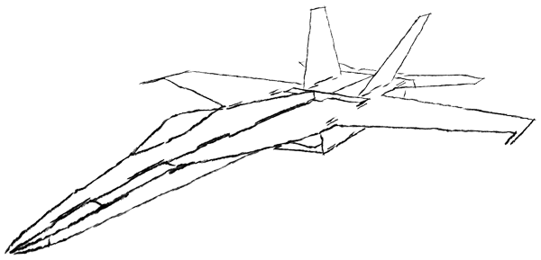

# Welcome

Here you can find an archive of plans, designed by [me](https://tomhe.net), for depron RC airplane models. I'm not actively developing new plans.

Pusher-prop jets:
* [Eurofighter Typhoon](/eurofighter/)
* [F-16 Fighting Falcon](/f-16/)
* [F-22 Raptor](/f-22/)
* [F/A-18 Super Hornet](/fa-18/)
* [MiG-29 Fulcrum](/mig-29/)
* [Su-37 Super Flanker](/su-37/)

3D aerobatics:
* [Sukhoi Su-31](/su-31/)

* * *



* * *

You are welcome to send me pictures of your builds if you use any of my plans. It's always appreciated.

E-mail: tomhe at tomhe dot net

Happy building!

*[Tomas Hellberg](https://tomhe.net)*
