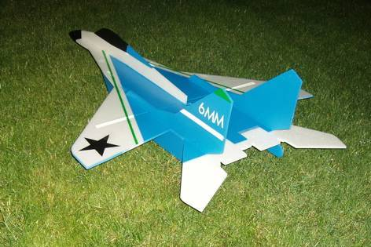

# Description

The MiG-29 is a mid-mounted pusher model intended to be flown with tailerons only, but it can easily be equipped with ailerons and rudders. Build it from the plans attached below.

The dimensions of the slots and tabs are made for 6 mm depron.

# Data

<dl>
  <dt>Wing span</dt>
  <dd>72 cm (28.3 inches)</dd>
  <dt>Length</dt>
  <dd>101 cm (39.7 inches)</dd>
  <dt>CoG location</dt>
  <dd><a href="./cg1.jpg">Bottom</a> <a href="./cg2.jpg">Top</a></dd>
  <dt>Propeller slot</dt>
  <dd>Fits propellers with a maximum diameter of 6 inches</dd>
</dl>

# Build instructions

6mmFlyRC has put together a [detailed build instruction](../docs/quick-build-mig-29.pdf).

# Forum discussion

[http://www.rcgroups.com/forums/showthread.php?t=757214](http://www.rcgroups.com/forums/showthread.php?t=757214)

# CAD images



# Build images



# Model images



# Plans



# License


