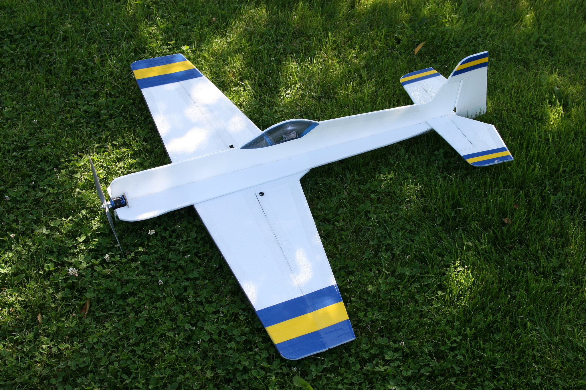

# Sukhoi Su-31

## Description

The Sukhoi Su-31 is an aerobatic 3D plane that is intended for outdoor use. Build it from the plans attached below.

I have marked out a slot for the motor, but you might want to modify it to for your particular motor and mount. I have included [a motor mount](./plans/su-31-r1-motor-mount.pdf) that fits the slot.

This is quite a large model, so make sure to user proper reinforcements on the wing and elevator, like stiff carbon fiber rods.

The dimensions of the slots and tabs are made for 6 mm depron.

## Data

<dl>
  <dt>Wing span</dt>
  <dd>105 cm (41 inches)</dd>
  <dt>Length</dt>
  <dd>98 cm (39 inches)</dd>
  <dt>CoG location</dt>
  <dd>5.7 cm (2.2 inches) behind wing leading edge</dd>
</dl>

## Build instructions

Not available.

## Forum discussion

[http://www.rcgroups.com/forums/showthread.php?t=1058716](http://www.rcgroups.com/forums/showthread.php?t=1058716)

## CAD images



## Build images

Not available.


## Model images



## Artwork




## Plans



## License


